# Організація баз даних 2026 - КР

<div align="right">
<strong>Група:</strong> ІО-42

<strong>Виконав:</strong> Семенюк В.Л.

<strong>Перевірив:</strong> Русінов В. В.
</div>

## **Тема:**
Система продажу квитків на події
## **Мета:**
Спроектувати базу даних для платформи продажу квитків на події, яка управляє майданчиками, подіями, типами квитків, клієнтами та покупками квитків.

## Виконання роботи

### Підготовка схеми бази даних
Необхідні сутності
- Майданчики (назва, розташування, місткість)
- Події (назва події, дата, час, тип події)
- Типи квитків (VIP, звичайний, студентський з різними цінами)
- Клієнти (інформація про обліковий запис)
- Покупки квитків (дата покупки, кількість, загальна ціна)
```
CREATE TABLE fields (
	field_id SERIAL PRIMARY KEY,
	title VARCHAR(67) NOT NULL,
	capacity INTEGER NOT NULL,
	location VARCHAR(255) NOT NULL
);
CREATE TABLE events (
	event_id SERIAL PRIMARY KEY,
	field_id INTEGER REFERENCES fields(field_id) NOT NULL,
	title VARCHAR(43) NOT NULL,
	data_day DATe NOT NULL,
	data_time TIME NOT NULL,
	event_type VARCHAR(255)
);
CREATE TABLE ticket_types (
	ticket_id SERIAL PRIMARY KEY,
	event_id INTEGER NOT NULL REFERENCES events(event_id),
	ticket_type VARCHAR(15) NOT NULL,
	price INTEGER NOT NULL CHECK (price >= 0)
);
CREATE TABLE clients (
	client_id SERIAL PRIMARY KEY,
	nickname VARCHAR(36) NOT NULL,
	email VARCHAR(255) NOT NULL UNIQUE,
	password VARCHAR(255),
	phone_number VARCHAR(20),
	birthday DATE
);
CREATE TABLE purchases (
	purchase_id SERIAL PRIMARY KEY,
	client_id INTEGER REFERENCES clients(client_id) NOT NULL,
	ticket_id INTEGER REFERENCES ticket_types(ticket_id) NOT NULL,
	purchase_date TIMESTAMP NOT NULL,
	amount INTEGER NOT NULL CHECK (amount > 0),
	total_price INTEGER NOT NULL CHECK (total_price >= 0)
);
```
<p align="center">
  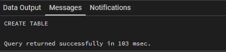<br>
  <i>Створення</i>
</p>

Заповнення інсертами по два приклади в кожну таблицю

```
INSERT INTO fields (title, capacity, location) VALUES
('field1', 500, 'Kyiv'),
('field2', 100, 'Rivne');
INSERT INTO events (field_id, title, data_day, data_time, event_type) VALUES
(1, 'Concert', '2026-05-10', '19:00', 'Music'),
(2, 'Vistava', '2026-06-15', '20:00', 'Vistavka');
INSERT INTO ticket_types (event_id, ticket_type, price) VALUES
(1, 'VIP', 1699),
(2, 'Standard', 799);
INSERT INTO clients (nickname, email, password, phone_number, birthday) VALUES
('mishapoka', 'exaergrert@mail.com', '12345', '034234233', '2004-3-29'),
('misterfurry', 'ferwfert@mail.com', 'qwerty', '023554455666', '1995-05-05');
INSERT INTO purchases (client_id, ticket_id, purchase_date, amount, total_price) VALUES
(1, 1, CURRENT_TIMESTAMP, 1, 1699),
(2, 2, CURRENT_TIMESTAMP, 2, 1598);
```

<p align="center">
  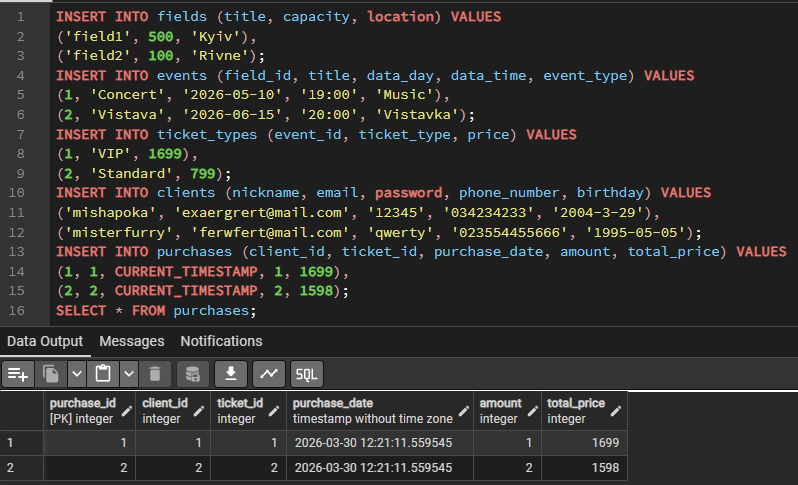<br>
  <i>purchases</i>
</p>
OLTP запити
2 INSERT запити до будь-яких таблиць уже виконані в попередньому пункті.
2 UPDATE запити до будь-яких таблиць:

```
UPDATE ticket_types
SET price = 2599
WHERE event_id = 1 AND ticket_type = 'VIP';
```

<p align="center">
  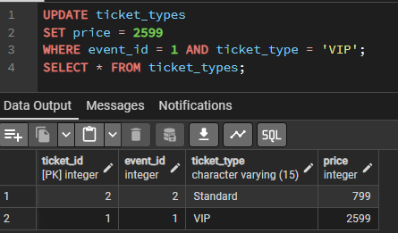<br>
  <i>UPDATE ticket_types</i>
</p>

```
UPDATE clients
SET phone_number = '88005553535'
WHERE nickname = 'mishapoka';
```

<p align="center">
  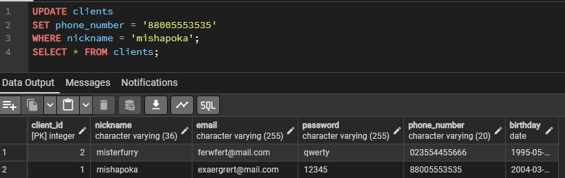<br>
  <i>UPDATE clients</i>
</p>
2 DELETE запити з будь-яких таблиць:

```
DELETE FROM purchases
WHERE purchase_id = 1;
```

<p align="center">
  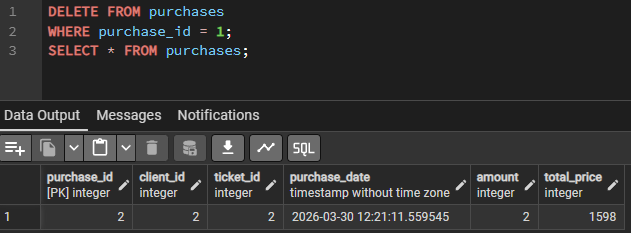<br>
  <i>DELETE FROM purchases</i>
</p>

```
DELETE FROM clients
WHERE nickname = 'mishapoka';
```

<p align="center">
  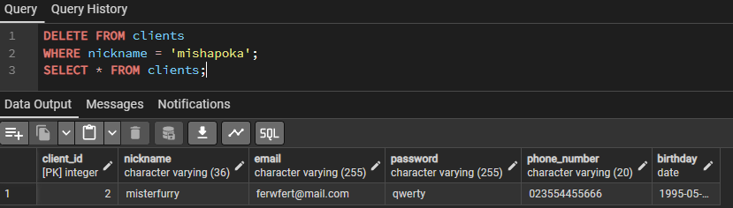<br>
  <i>DELETE FROM clients</i>
</p>
2 прості SELECT:

```
SELECT e.title, e.data_day, e.data_time, e.event_type
FROM events e
JOIN fields f ON e.field_id = f.field_id
WHERE f.title = 'field1';
```

<p align="center">
  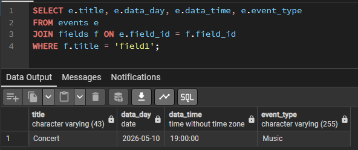<br>
  <i>SELECT 1</i>
</p>

```
SELECT
    ticket_types.ticket_type,
    fields.capacity - SUM(purchases.amount)
FROM ticket_types
JOIN events ON ticket_types.event_id = events.event_id
JOIN fields ON events.field_id = fields.field_id
JOIN purchases ON ticket_types.ticket_id = purchases.ticket_id
GROUP BY ticket_type, capacity;
```

<p align="center">
  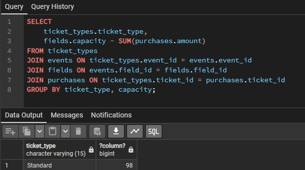<br>
  <i>SELECT 2</i>
</p>
ОLAP запити

```
SELECT e.event_type, SUM(p.total_price)
FROM events e
JOIN ticket_types tt ON e.event_id = tt.event_id
JOIN purchases p ON tt.ticket_id = p.ticket_id
GROUP BY e.event_type;
```

<p align="center">
  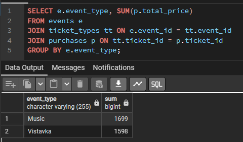<br>
  <i>Обчислити загальний дохід за типом події</i>
</p>

```
SELECT e.title, SUM(p.amount)
FROM events e
JOIN ticket_types tt ON e.event_id = tt.event_id
JOIN purchases p ON tt.ticket_id = p.ticket_id
GROUP BY e.title
ORDER BY SUM(p.amount) DESC
LIMIT 10;
```

<p align="center">
  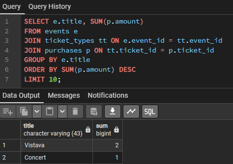<br>
  <i>Знайти топ-10 найбільш продаваних подій</i>
</p>

```
SELECT f.title, AVG(tt.price)
FROM fields f
JOIN events e ON f.field_id = e.field_id
JOIN ticket_types tt ON e.event_id = tt.event_id
GROUP BY f.title;
```

<p align="center">
  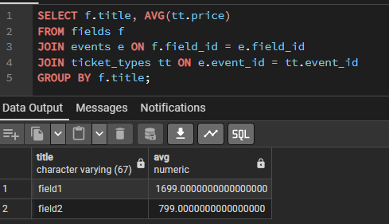<br>
  <i>Обчислити середню ціну квитка за майданчиком</i>
</p>

```
SELECT c.nickname, e.data_day
FROM clients c
JOIN purchases p ON c.client_id = p.client_id
JOIN ticket_types tt ON p.ticket_id = tt.ticket_id
JOIN events e ON tt.event_id = e.event_id
GROUP BY c.nickname, e.data_day
HAVING COUNT(DISTINCT e.event_id) > 1;
```

<p align="center">
  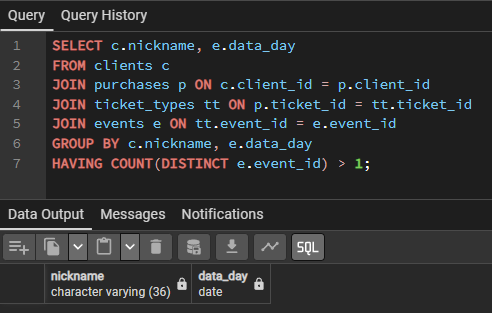<br>
  <i>Знайти клієнтів, які купили квитки на декілька подій на одну і ту ж дату</i>
</p>
На останній випадок у нас нікого немає). Мені лінь було для двох оснтанніх міняти вміст таблиць, щоб продемонструвати правильність, хоча виглядає працюючим)
