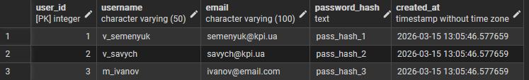
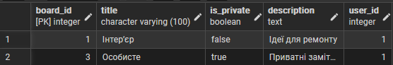
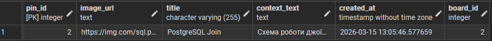
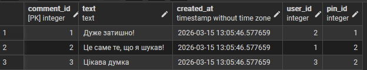
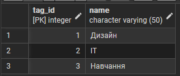
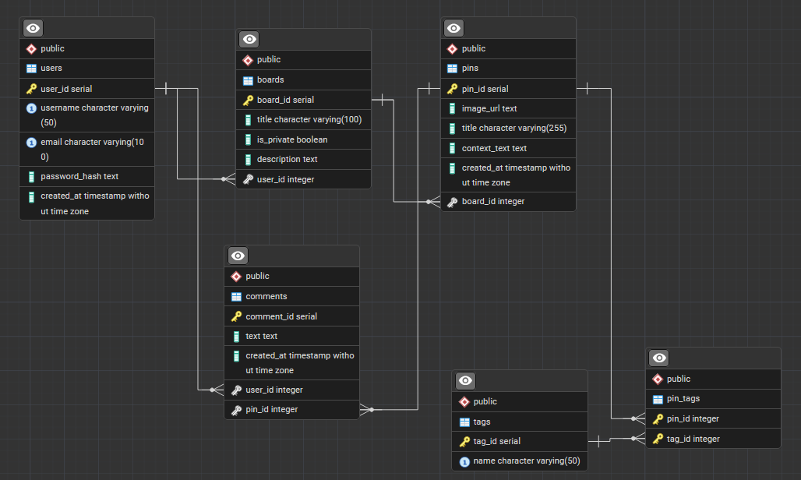

# Лабораторна робота №2

<div align="right">
<strong>Група:</strong> ІО-42

<strong>Виконали:</strong> Семенюк В.Л.,
Савич В.Я.

<strong>Перевірив:</strong> Русінов В. В.
</div>

## **Тема:**
Перетворення ER-діаграми на схему PostgreSQL
## **Мета:**
Написати SQL DDL-інструкції для створення кожної таблиці з вашої ERD в PostgreSQL.
Вказати відповідні типи даних для кожного стовпця, вибрати первинний ключ для кожної таблиці та визначити будь-які необхідні зовнішні ключі, обмеження UNIQUE, NOT NULL, CHECK або DEFAULT.
Вставити зразки рядків (принаймні 3–5 рядків на таблицю) за допомогою INSERT INTO.
Протестувати все в pgAdmin (або іншому клієнті PostgreSQL), щоб переконатися, що таблиці та дані завантажуються правильно.

## Виконання роботи
### PostgreSQL
```
CREATE TABLE users (
    user_id SERIAL PRIMARY KEY,
    username VARCHAR(50) UNIQUE NOT NULL,
    email VARCHAR(100) UNIQUE NOT NULL CHECK (email LIKE '%@%'),
    password_hash TEXT NOT NULL,
    created_at TIMESTAMP DEFAULT CURRENT_TIMESTAMP
);

CREATE TABLE boards (
    board_id SERIAL PRIMARY KEY,
    title VARCHAR(100) NOT NULL,
    is_private BOOLEAN DEFAULT FALSE,
    description TEXT,
    user_id INTEGER NOT NULL REFERENCES users(user_id) ON DELETE CASCADE
);

CREATE TABLE pins (
    pin_id SERIAL PRIMARY KEY,
    image_url TEXT NOT NULL CHECK (image_url LIKE 'http%'),
    title VARCHAR(255) NOT NULL,
    context_text TEXT,
    created_at TIMESTAMP DEFAULT CURRENT_TIMESTAMP,
    board_id INTEGER NOT NULL REFERENCES boards(board_id) ON DELETE CASCADE
);

CREATE TABLE comments (
    comment_id SERIAL PRIMARY KEY,
    text TEXT NOT NULL,
    created_at TIMESTAMP DEFAULT CURRENT_TIMESTAMP,
    user_id INTEGER NOT NULL REFERENCES users(user_id) ON DELETE CASCADE,
    pin_id INTEGER NOT NULL REFERENCES pins(pin_id) ON DELETE CASCADE
);

CREATE TABLE tags (
    tag_id SERIAL PRIMARY KEY,
    name VARCHAR(50) UNIQUE NOT NULL
);

CREATE TABLE pin_tags (
    pin_id INTEGER REFERENCES pins(pin_id) ON DELETE CASCADE,
    tag_id INTEGER REFERENCES tags(tag_id) ON DELETE CASCADE,
    PRIMARY KEY (pin_id, tag_id)
);

INSERT INTO users (username, email, password_hash) VALUES
('v_semenyuk', 'semenyuk@kpi.ua', 'pass_hash_1'),
('v_savych', 'savych@kpi.ua', 'pass_hash_2'),
('m_ivanov', 'ivanov@email.com', 'pass_hash_3');

INSERT INTO boards (title, is_private, description, user_id) VALUES
('Інтер’єр', false, 'Ідеї для ремонту', 1),
('Програмування', false, 'Корисні шпаргалки по SQL', 2),
('Особисте', true, 'Приватні замітки', 1);

INSERT INTO pins (image_url, title, context_text, board_id) VALUES
('https://img.com/room.jpg', 'Скандинавський стиль', 'Світлі кольори', 1),
('https://img.com/sql.png', 'PostgreSQL Join', 'Схема роботи джоїнів', 2),
('https://img.com/plan.jpg', 'План на літо', 'Список подорожей', 3);

INSERT INTO comments (text, user_id, pin_id) VALUES
('Дуже затишно!', 2, 1),
('Це саме те, що я шукав!', 1, 2),
('Цікава думка', 3, 2);

INSERT INTO tags (name) VALUES
('Дизайн'), ('IT'), ('Навчання');

INSERT INTO pin_tags (pin_id, tag_id) VALUES
(1, 1),
(2, 2),
(2, 3);
```

### Тестування

<p align="center">
  <br>
  <i>SELECT * FROM users;</i>
</p>

<p align="center">
  <br>
  <i>SELECT * FROM boards WHERE user_id = 1;</i>
</p>

<p align="center">
  <br>
  <i>SELECT * FROM pins WHERE board_id = 2;</i>
</p>

<p align="center">
  <br>
  <i>SELECT * FROM comments;</i>
</p>

<p align="center">
  <br>
  <i>SELECT * FROM tags;</i>
</p>

<p align="center">
  <br>
  <i>ER-діаграма для бази даних</i>
</p>

# Висновок
У ході виконання лабораторної роботи було успішно реалізовано перехід від ER-моделі до схеми бази даних у середовищі PostgreSQL. Створено 5 таблиць (users, boards, pins, comments, tags) та допоміжну таблицю pin_tags для реалізації зв’язку багато-до-багатьох. Розроблена реляційна схема відповідає функціональним вимогам і готова до подальшого використання у наступних роботах.
