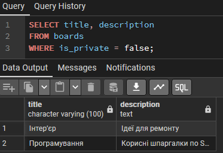
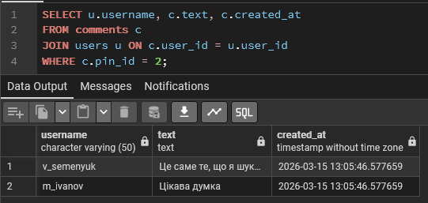
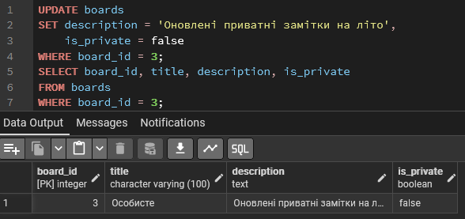
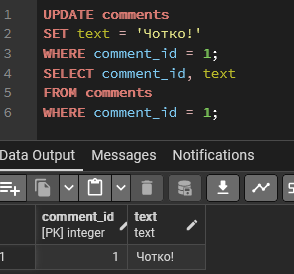
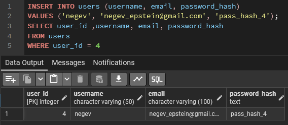
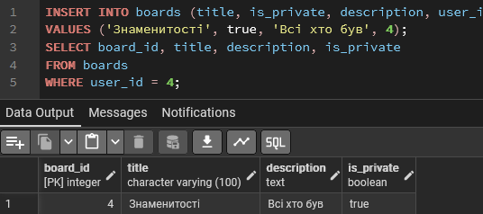

# Лабораторна робота №3

<div align="right">
<strong>Група:</strong> ІО-42

<strong>Виконали:</strong> Семенюк В.Л.,
Савич В.Я.

<strong>Перевірив:</strong> Русінов В. В.
</div>

## **Тема:**
Маніпулювання даними SQL (OLTP)
## **Мета:**
Написати запити SELECT для отримання даних (включаючи фільтрацію за допомогою WHERE та вибір певних стовпців).
Практикувати використання операторів INSERT для додавання нових рядків до таблиць.
Практикувати використання оператора UPDATE для зміни існуючих рядків (використовуючи SET та WHERE).
Практикувати використання операторів DELETE для безпечного видалення рядків (за допомогою WHERE).
Вивчити основні операції маніпулювання даними (DML) у PostgreSQL та спостерігати за їхнім впливом.

## Виконання роботи

### Тестування
Згідно з вимогами лабораторної, потрібно вибирати конкретні стовпці та використовувати фільтрацію WHERE.
```
SELECT title, description
FROM boards
WHERE is_private = false;
```
<p align="center">
  <br>
  <i>Отримати назви та описи лише публічних дошок.</i>
</p>

```
SELECT u.username, c.text, c.created_at
FROM comments c
JOIN users u ON c.user_id = u.user_id
WHERE c.pin_id = 2;
```

<p align="center">
  <br>
  <i>(з об'єднанням) Знайти імена користувачів та тексти їхніх коментарів до конкретного піна</i>
</p>

```
UPDATE boards
SET description = 'Оновлені приватні замітки на літо',
    is_private = false
WHERE board_id = 3;
```

<p align="center">
  <br>
  <i>Оновимо опис 3-ї дошки та змінимо її статус на публічний.</i>
</p>

```
UPDATE comments
SET text = 'Чотко!'
WHERE comment_id = 1;
```

<p align="center">
  <br>
  <i>Виправлення тексту коментаря.</i>
</p>

```
INSERT INTO users (username, email, password_hash)
VALUES ('negev', 'negev_epstein@gmail.com', 'pass_hash_4');
```

<p align="center">
  <br>
  <i>Додамо нового користувача.</i>
</p>

```
INSERT INTO boards (title, is_private, description, user_id)
VALUES ('Знаменитості', true, 'Всі хто був', 4);
```

<p align="center">
  <br>
  <i>Додамо нову дошку користувачеві.</i>
</p>

```
DELETE FROM comments
WHERE comment_id = 3;
```

<p align="center">
  <br>
  <i>Видалення коментаря.</i>
</p>

## Висновок
У ході виконання лабораторної роботи було протестовано створену базу даних за допомогою запитів. Відпрацьовано базові операції: додавання (INSERT), вибірку (SELECT), оновлення (UPDATE) та видалення (DELETE). Завдяки обов'язковому використанню умови WHERE та контрольних перевірок після кожної дії підтверджено коректність роботи схеми та цілісність даних.
