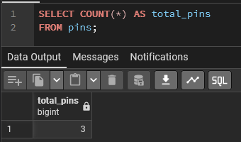
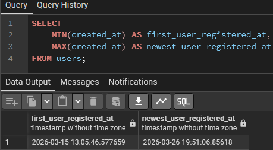
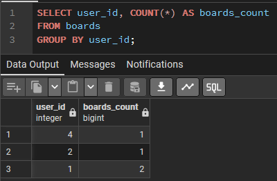
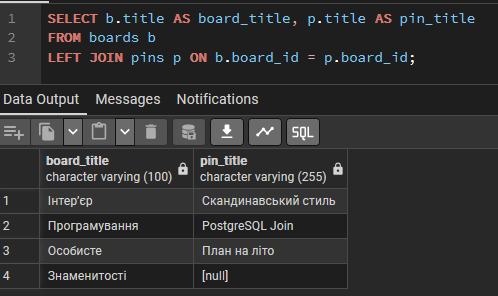
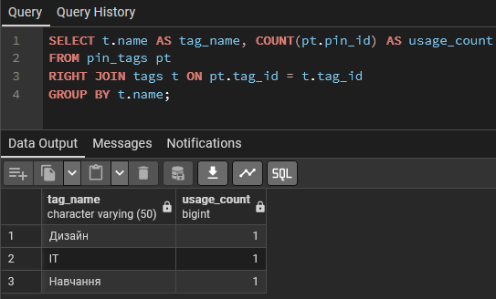
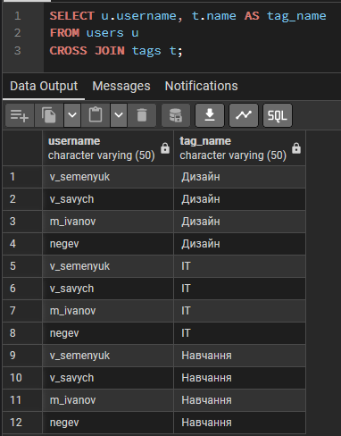
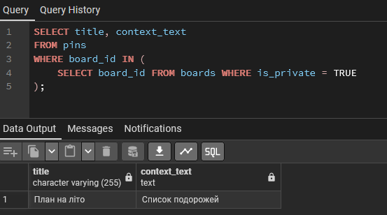
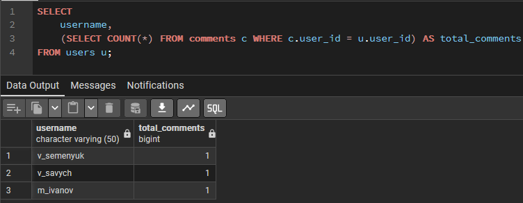
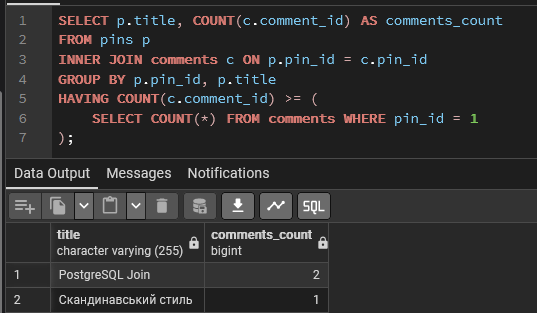

# Лабораторна робота №4

<div align="right">
<strong>Група:</strong> ІО-42

<strong>Виконали:</strong> Семенюк В.Л.,
Савич В.Я.

<strong>Перевірив:</strong> Русінов В. В.
</div>

## **Тема:**
Аналітичні SQL-запити (OLAP)
## **Мета:**
  Використати агрегатні функції, такі як COUNT, SUM, AVG, MIN та MAX, для
обчислення зведеної статистики з ваших даних.
  Написати запити GROUP BY для групування рядків за одним або кількома
стовпцями та обчислення агрегатів для кожної групи.
  Використати HAVING для фільтрації результатів згрупованих запитів на основі
агрегованих умов.
  Виконувати операції JOIN (принаймні INNER JOIN та LEFT JOIN), щоб об'єднати
дані з кількох таблиць.
  Створювати об'єднані запити на агрегацію для кількох таблиць, які об'єднують
таблиці та створюють згрупований, агрегований вивід.
Інтерпретувати результати ваших запитів та поясніть, що робить кожен з них.

## Виконання роботи

### OLAP запити
```
SELECT COUNT(*) AS total_pins
FROM pins;
```
<p align="center">
  <br>
  <i> Підрахунок загальної кількості пінів у системі</i>
</p>

```
SELECT
    MIN(created_at) AS first_user_registered_at,
    MAX(created_at) AS newest_user_registered_at
FROM users;
```

<p align="center">
  <br>
  <i>Час реєстрації першого та останнього користувача</i>
</p>

```
SELECT user_id, COUNT(*) AS boards_count
FROM boards
GROUP BY user_id;
```

<p align="center">
  <br>
  <i>Кількість дошок, створених кожним користувачем</i>
</p>

```
SELECT u.username, COUNT(b.board_id) AS boards_count
FROM users u
INNER JOIN boards b ON u.user_id = b.user_id
GROUP BY u.username
HAVING COUNT(b.board_id) > 1;
```

<p align="center">
  <br>
  <i>Користувачі, які мають більше 1 дошки</i>
</p>

```
SELECT b.title AS board_title, p.title AS pin_title
FROM boards b
LEFT JOIN pins p ON b.board_id = p.board_id;
```

<p align="center">
  <br>
  <i>Виведення всіх дошок та назв пінів на них</i>
</p>

```
SELECT t.name AS tag_name, COUNT(pt.pin_id) AS usage_count
FROM pin_tags pt
RIGHT JOIN tags t ON pt.tag_id = t.tag_id
GROUP BY t.name;
```

<p align="center">
  <br>
  <i>Кількість використань кожного тегу.</i>
</p>

```
SELECT u.username, t.name AS tag_name
FROM users u
CROSS JOIN tags t;
```

<p align="center">
  <br>
  <i>CROSS JOIN</i>
</p>

```
SELECT title, context_text
FROM pins
WHERE board_id IN (
    SELECT board_id FROM boards WHERE is_private = TRUE
);
```

<p align="center">
  <br>
  <i>Знайти всі піни, які збережені на приватних дошках</i>
</p>

```
SELECT
    username,
    (SELECT COUNT(*) FROM comments c WHERE c.user_id = u.user_id) AS total_comments
FROM users u;
```

<p align="center">
  <br>
  <i>Для кожного користувача вивести його ім'я та загальну кількість залишених ним коментарів</i>
</p>

```
SELECT p.title, COUNT(c.comment_id) AS comments_count
FROM pins p
INNER JOIN comments c ON p.pin_id = c.pin_id
GROUP BY p.pin_id, p.title
HAVING COUNT(c.comment_id) >= (
    SELECT COUNT(*) FROM comments WHERE pin_id = 1
);
```

<p align="center">
  <br>
  <i>Знайти піни, кількість коментарів під якими перевищує або дорівнює кількості коментарів під піном з ID = 1</i>
</p>

## Висновок
У ході виконання лабораторної роботи було успішно закріплено практичні навички проєктування та виконання аналітичних SQL-запитів (OLAP) у середовищі PostgreSQL. Практично застосовано агрегатні функції (COUNT, MIN, MAX) у комбінації з оператором GROUP BY. Відпрацьовано фільтрацію вже згрупованих даних за допомогою умови HAVING. Налаштовано об'єднання даних з кількох таблиць за допомогою INNER JOIN, LEFT JOIN, RIGHT JOIN та CROSS JOIN. Реалізовано вкладені запити у блоках SELECT, WHERE та HAVING.
